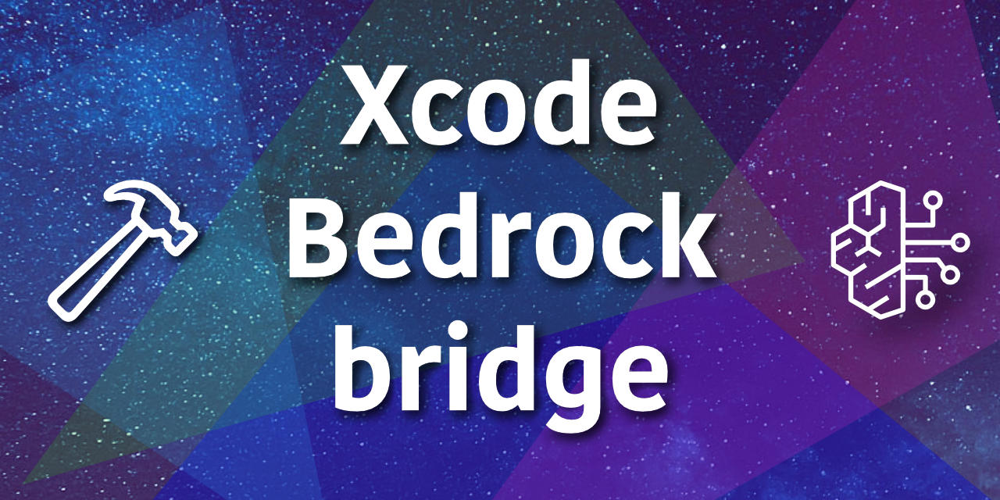

# xcode-bedrock-bridge

[](https://github.com/Andrea-Scuderi/xcode-bedrock-bridge/actions/workflows/ci.yml)
[](https://www.swift.org)
[](https://github.com/Andrea-Scuderi/xcode-bedrock-bridge)



Xcode Bedrock Bridge is a lightweight, high-performance proxy designed to connect your Apple development environment directly to Large Language Models on AWS.

By acting as a secure intermediary, it allows developers to leverage the power of Amazon Bedrock (including Claude, Amazon Nova, Llama, Mistral, and many more) without exposing sensitive AWS credentials within the client application.

Xcode speaks OpenAI and Anthropic API formats; Bedrock uses its own Converse API with AWS SigV4 auth. This proxy handles the translation transparently so you can use any Claude model on Bedrock as a backend for both Xcode Intelligence (code completions) and the Xcode Coding Agent (agentic coding).

---

## How it works

```
Xcode Intelligence          ──► POST /v1/chat/completions     ─┐
(code completion, chat)         GET  /v1/models                │
                                                               │  xcode-bedrock-bridge
Xcode Coding Agent          ──► POST /v1/messages             ─┤  (Vapor + Soto)
(file read/write/run tools)     POST /v1/messages/count_tokens │
                                                               │
                                                               └──► AWS Bedrock
                                                                    Converse API
                                                                    (Claude models)
```

```
[ Xcode ] <───(PROXY_API_KEY)───> [ xcode-bedrock-bridge ] <───(IAM/BEDROCK_API_KEY)───> [ Amazon Bedrock ]
    |                                      |                                                   |
 Local Dev                          Security & Proxy                                       Cloud LLMs
```


Both Xcode integration modes are covered:

| Xcode feature | Wire format | Endpoints |
|---|---|---|
| **Xcode Intelligence** — inline completions, editor chat | OpenAI | `GET /v1/models`, `POST /v1/chat/completions` |
| **Xcode Coding Agent** — agentic coding with tools | Anthropic Messages | `POST /v1/messages`, `POST /v1/messages/count_tokens` |
| **Health check** — Docker / load-balancer probe | — | `GET /health` |

**What it supports:**
- Streaming and non-streaming completions (SSE)
- Image input (JPEG, PNG, GIF, WebP — up to 3.75 MB) on capable models
- Tool use / function calling (Anthropic Coding Agent)
- Token counting (`POST /v1/messages/count_tokens`)
- Live model discovery via `Bedrock:ListFoundationModels`
- Three authentication methods: AWS profile, access key/secret, or Bedrock API key

---

## Requirements

- macOS 15+
- Swift 6
- Xcode 26.3+
- An AWS account with [Bedrock model access](https://docs.aws.amazon.com/bedrock/latest/userguide/model-access.html) enabled for the Claude models you want to use

---

## Quick start

### 1. Clone and build

```bash
git clone https://github.com/yourname/xcode-bedrock-bridge
cd xcode-bedrock-bridge
swift build -c release
```

### 2. Set up AWS credentials

**Option A — AWS profile** (recommended):
```bash
export PROFILE=your-bedrock-profile   # reads from ~/.aws/credentials
```

**Option B — environment variables:**
```bash
export AWS_ACCESS_KEY_ID=AKIA...
export AWS_SECRET_ACCESS_KEY=...
export AWS_SESSION_TOKEN=...          # only for temporary credentials
```

**Option C — Bedrock API key:**
```bash
export BEDROCK_API_KEY=your-bedrock-api-key
```
> With a Bedrock API key the live model list is unavailable; the proxy falls back to the built-in model list automatically.

The IAM user/role needs these permissions:
```json
{
  "Effect": "Allow",
  "Action": [
    "bedrock:InvokeModel",
    "bedrock:InvokeModelWithResponseStream",
    "bedrock:ListFoundationModels"
  ],
  "Resource": "*"
}
```

> `bedrock:ListFoundationModels` is only needed for the live model list on `GET /v1/models`. If it is missing the endpoint falls back to the built-in fallback list automatically.

### 3. Run

```bash
export AWS_REGION=us-east-1
export PROXY_API_KEY=my-secret-key    # optional — enables auth on OpenAI endpoints
swift run -c release Run
```

The server listens on `http://localhost:8080` by default.

### 4. Verify

```bash
# List models
curl -H "x-api-key: my-secret-key" http://localhost:8080/v1/models

# Non-streaming chat
curl -s -X POST http://localhost:8080/v1/chat/completions \
  -H "x-api-key: my-secret-key" \
  -H "Content-Type: application/json" \
  -d '{
    "model": "claude-sonnet-4-5",
    "messages": [{"role": "user", "content": "Say hello"}],
    "max_tokens": 64
  }'

# Streaming chat
curl -N -X POST http://localhost:8080/v1/chat/completions \
  -H "x-api-key: my-secret-key" \
  -H "Content-Type: application/json" \
  -d '{
    "model": "claude-sonnet-4-5",
    "messages": [{"role": "user", "content": "Count to 5"}],
    "max_tokens": 64,
    "stream": true
  }'
```

---

## Docker

### Prerequisites

- [Docker Desktop](https://www.docker.com/products/docker-desktop/) (or Docker Engine + Compose plugin)

### 1. Configure credentials

```bash
cp .env.example .env
```

Edit `.env` and fill in your credentials (`.env` is gitignored — never committed):

```bash
# Option A — Bedrock API key (simplest)
BEDROCK_API_KEY=your-bedrock-api-key

# Option B — Scoped IAM user (create an IAM user with bedrock:* only)
# AWS_ACCESS_KEY_ID=AKIA...
# AWS_SECRET_ACCESS_KEY=...
```

### 2. Build and run

```bash
docker compose up --build
```

The proxy listens on `http://localhost:8080`.

### 3. Verify

```bash
# Health check — no credentials needed
curl http://localhost:8080/health

# List models — requires valid AWS credentials
curl http://localhost:8080/v1/models
```

### Notes

- Credentials are loaded from `.env` via `env_file` in `docker-compose.yml` — no AWS credential files are mounted into the container.
- The container binds to `0.0.0.0` (set via `BIND_HOST`) so Docker's port mapping works. The Anthropic `/v1/messages` endpoint is unauthenticated — set `PROXY_API_KEY` in `.env` and use a reverse proxy if you expose this service beyond localhost.
- For cloud deployments (ECS, EC2), remove the credential env vars from `docker-compose.yml` and attach an IAM role to the instance/task instead.

---

## Xcode setup

### Xcode Intelligence (code completions & chat)

1. Open **Xcode → Settings → Intelligence**
2. Click **Add Model Provider** → choose **Internet Hosted**
3. Fill in:
   - **Base URL:** `http://localhost:8080` *(do not add `/v1` — Xcode appends it)*
   - **API Key:** value of `PROXY_API_KEY` (or leave blank if auth is disabled)
   - **API Key Header:** `x-api-key`
4. Select a model from the list (e.g. `Claude Sonnet 4.5` or `Nova Pro`)

### Xcode Coding Agent

The Claude Agent uses the Anthropic API format and reads its endpoint from a config file:

```bash
mkdir -p ~/Library/Developer/Xcode/CodingAssistant/ClaudeAgentConfig
```

Create or edit `settings.json` in that directory:

```json
{
  "env": {
    "ANTHROPIC_BASE_URL": "http://localhost:8080",
    "ANTHROPIC_AUTH_TOKEN": "placeholder"
  }
}
```

If Xcode blocks the connection with an auth error, run this once:
```bash
defaults write com.apple.dt.Xcode IDEChatClaudeAgentAPIKeyOverride ' '
```

---

## Available models

`GET /v1/models` returns human-readable **model names** as the `id` field. Xcode displays these
in the model picker and sends the chosen name back in subsequent requests. The proxy resolves each
name to the correct Bedrock inference profile ID automatically.

Model resolution priority (highest first):

| Source | When used |
|--------|-----------|
| `models.json` (project root) | Always, if the file is present |
| Live `bedrock:ListFoundationModels` | When `models.json` is absent and real AWS credentials are configured |
| Empty list | When using a Bedrock API key without a `models.json` file |

### Using `models.json`

Placing a `models.json` file in the project root lets you control the model list without an AWS
management-plane API call. Generate it from the AWS CLI and copy it:

```bash
aws bedrock list-foundation-models --region us-east-1 > models.json
```

A `models.json.example` is included in the repository as a reference.

Models that support `INFERENCE_PROFILE` (cross-region inference) are automatically prefixed with
`CROSS_REGION_PREFIX` (default `global`). For single-region setups override this:

```bash
export CROSS_REGION_PREFIX=us   # use us.* profile IDs instead of global.*
```

> **Enable model access first.** Go to the [AWS Bedrock console](https://console.aws.amazon.com/bedrock/)
> → **Model access** and request access for each model you want to use. Without this step requests
> will fail with a `ResourceNotFoundException`.

---

## Image input

The proxy supports multi-modal image input on both the OpenAI (`/v1/chat/completions`) and Anthropic (`/v1/messages`) endpoints for models that accept images. Image capability is determined from `inputModalities` in `models.json` when that file is present; otherwise a built-in prefix list is used.

- **Formats:** JPEG, PNG, GIF, WebP
- **Size limit:** 3.75 MB per image (decoded)
- Images are passed as base64-encoded data URLs in the standard OpenAI / Anthropic format.

---

## Configuration

Configuration is resolved in priority order: **process environment variables** win, then `.env`
(dotenv format, `KEY=VALUE`), then `config.json` (nested JSON). Both files are optional and
gitignored — the server starts with env vars only if neither file is present.

### Environment variables

| Variable | Default | Description |
|---|---|---|
| `AWS_REGION` | `us-east-1` | Bedrock region |
| `PROFILE` | — | AWS credentials profile name (`~/.aws/credentials`) |
| `AWS_ACCESS_KEY_ID` | — | AWS access key (alternative to `PROFILE`) |
| `AWS_SECRET_ACCESS_KEY` | — | AWS secret key |
| `AWS_SESSION_TOKEN` | — | Session token for temporary credentials |
| `DEFAULT_BEDROCK_MODEL` | `us.anthropic.claude-sonnet-4-5-20250929-v1:0` | Fallback when model alias is not found |
| `PROXY_API_KEY` | — | Auth key for OpenAI endpoints. Auth disabled if unset. |
| `PORT` | `8080` | HTTP listen port |
| `LOG_LEVEL` | `info` | Vapor log level (`debug` shows raw Xcode payloads) |
| `CROSS_REGION_PREFIX` | `global` | Prefix prepended to cross-region inference profile IDs when using `models.json` (e.g. `us`, `eu`, `ap`, `global`) |

### `.env` file (dotenv, optional, gitignored)

Create `.env` in the project root directory using standard `KEY=VALUE` format:

```
AWS_REGION=us-east-1
PROFILE=my-bedrock-profile
PROXY_API_KEY=my-secret-key
PORT=8080
```

### `config.json` file (JSON, optional, gitignored)

Create `config.json` in the project root using nested keys:

```json
{
  "aws": { "region": "us-east-1", "profile": "my-bedrock-profile" },
  "bedrock": { "api": { "key": "..." } },
  "default": { "bedrock": { "model": "us.anthropic.claude-sonnet-4-5-20250929-v1:0" } },
  "proxy": { "api": { "key": "my-secret-key" } },
  "port": 8080
}
```

---

## Troubleshooting

**`ResourceNotFoundException: Model use case details have not been submitted`**
→ Request model access in the AWS Bedrock console.

**`ValidationException: on-demand throughput isn't supported`**
→ You are passing a bare `anthropic.*` model ID for an older model. Use the `us.anthropic.*` inference profile ID instead.

**`AccessDeniedException`**
→ Your IAM credentials lack `bedrock:InvokeModel` / `bedrock:InvokeModelWithResponseStream`.

**Xcode doesn't show any models**
→ Check that the proxy is running, the base URL has no `/v1` suffix, and the API key header is set to `x-api-key`.

**Enable debug logging** to see the exact payloads Xcode sends:
```bash
LOG_LEVEL=debug swift run Run
```

---

## Security

### Localhost-only binding

The server binds to `127.0.0.1` by default. The Anthropic `/v1/messages` endpoint (used by the Xcode Coding Agent) is unauthenticated — this proxy is designed for local development and should **never** be exposed to a wider network without additional safeguards.

Set `BIND_HOST=0.0.0.0` (or use the provided `docker-compose.yml`) when running inside Docker — Docker's port mapping requires the server to accept connections on all interfaces inside the container. If you do this, ensure `PROXY_API_KEY` is set and consider placing the proxy behind a reverse proxy.

### Debug logging

`LOG_LEVEL=debug` logs full request payloads — user prompts, tool calls, and model responses — to stdout in plaintext. **Do not enable debug logging in shared or multi-user environments.** Use the default `info` level in any non-development setting.

### Proxy API key

`PROXY_API_KEY` protects the OpenAI endpoints (`/v1/chat/completions`, `/v1/models`). Use a randomly generated key of at least 32 characters. The server warns at startup if the key is shorter than 16 characters.

---

## Development

```bash
# Build
swift build

# Run tests
swift test

# Run with debug logging
LOG_LEVEL=debug swift run Run
```

For full protocol details, implementation notes, and all web references see [SPECS.md](SPECS.md).

---

## License

Apache 2.0
